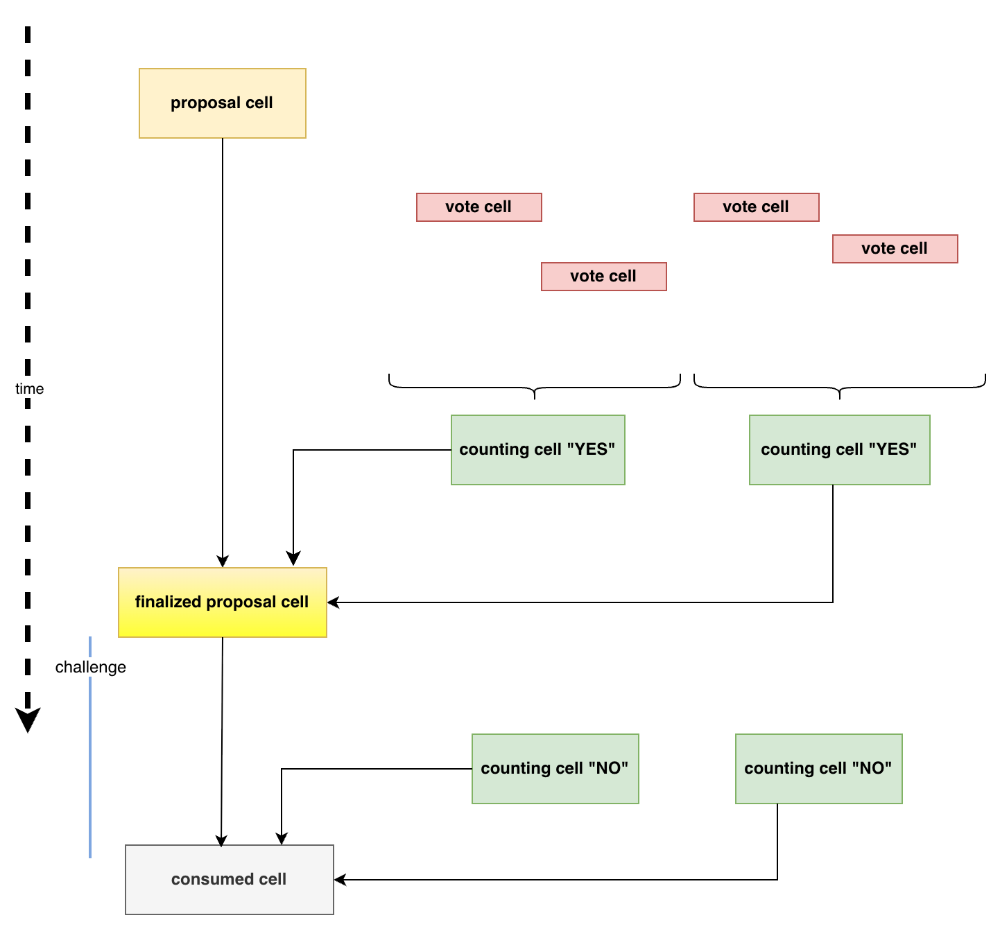

# Voting System

## Introduction
This is a draft voting system design on CKB. It relies solely on on-chain scripts
and requires no changes to the nodes. The design follows these rules:

1. Specific cells are identified by their associated type scripts.
2. Unless specified otherwise, their lock scripts are not restricted.

## How to Read
This design document provides an overview of the voting system, along with the following specifications:
- [Proposal Type Script Specification](./proposal-type-script-spec.md)
- [Vote Type Script Specification](./vote-type-script-spec.md)
- [Counting Type Script Specification](./counting-type-script-spec.md)
- [Config Type Script Specification](./config-type-script-spec.md)

It includes all the necessary design details. For more details, such as data structures, refer to the corresponding specifications.

## Conventions
The following conventions are used in design and spec documents.
- ckb-hash: denotes the blake2b hash function with the following configuration:
  * output digest size: 32
  * personalization: ckb-default-hash
- ckb-blake160-hash: the leading 20 bytes of ckb-hash.
- A config cell is used for this voting system. Any field can be referred to as `config.<field>`. During processing, the script first loads the predefined config cell and then reads the field in molecule format.

## Processing

### Proposal Cell

A proposal initiator can create a proposal cell. And then the voting begins.
The lock script should be chosen an initiator's pubkey to control final operating.
The `args` in the type script should be generated by the `Type ID` rule, which makes `args` unique
across the whole blockchain. This also means that type scripts are unique. It has following properties:
1. It can be updated without changing its type script
2. It can be consumed and burnt

These rules are actually the same as the `Type ID` rules. Some fields should be defined in the cell data:
1. config.vote_duration: after this time, the initiator can update the proposal to be finalized.
2. applied_amount: the amount of assets that can be granted if the voting passes.
3. status: should be `proposal`, `finalized`, `passed` to present different status. The initial status is `proposal`.

### Vote Cell

DAO owners can now vote by sending a vote cell. A vote cell has the following properties:
1. It should refer to the proposal cell via cell_deps
2. Its type script args contain the hash of the proposal type script hash
3. It should refer to DAO deposit cells via cell_deps. All these cells should be older than the proposal cell
4. Its cell data contains the sum of all DAO deposit amounts
5. Its cell data contains a direction: "yes" or "no"
6. An input lock script representing the DAO deposit owner should be unlocked. All the referred DAO deposit cells should have the same lock script
7. The same lock script should appear in the first output cells

A vote unlocks an existing cell to represent ownership of a DAO deposit. The vote is recorded in its cell data.
Since the DAO deposit must be older than the proposal cell, it's impossible to use tricks like voting, withdrawing, and re-voting.

### Counting Cell
The initiator can collect votes before the proposal cell is consumed. This is done in counting cells. In its cell data, it should specify a `hash range`: [h1, h2], where h1, h2 are inclusive, with both values in byte(0~65535). In its cell data, it should also specif a `direction` indicating it is collecting "yes" or "no" vote. It should follow these rules:

1. It should refer to the proposal cell via cell_deps
2. Its type script args contain the hash of proposal type script hash
3. It refers to vote cells via cell_deps
4. All the vote cells in cell_deps should have a lock script whose hash's first 2 bytes falls within the `hash range`
5. The vote cells' type script code_hash/hash_type are checked. The vote cells' type script args should be identical to the counting cell's type script args.
6. Its cell data contains the sum of all the vote cells' vote amounts
7. All vote cells' directions are same
8. All lock scripts in vote cells must be unique.

When the number of vote cells is small, one counting cell might be enough. It works by slicing the voting work into chunks to reduce storage and computation.

### Finalized Proposal Cell
Now all counting cells, together with the proposal cell, can be consumed to produce a new finalized proposal cell.
This must happen after `config.vote_duration`. The `vote_duration` is a relative `since` based on the proposal cell.
This is essentially the operation of updating the proposal cell, and it should follow these rules:

1. All counting cells have type script args that reference the hash of the proposal type script, and the proposal cell is an input cell.
2. The `hash range` of all counting cells should not overlap.
3. The vote amount should exceed the minimum requirement.
4. The output lock script should be the `always success` lock script. With this, it can be challenged by others.
5. The counting cell's type script code_hash/hash_type are checked.

The finalized proposal cell shares the same type script as the proposal cell, except that the status in the cell data is updated from `proposal` to `finalized`.

### Passed Proposal Cell
After a specific time, the finalized proposal cell can be turned into a passed proposal cell. It changes the status
in cell data from `finalized` to `passed`. With this cell, the initiator can be granted assets from the treasury.

### Challenge Phase
While waiting for the finalized proposal cell to turn into a passed proposal cell, anyone can challenge.
A challenger can collect "no" votes using counting cells. These "no" votes follow the same rules as "yes" votes, except that the direction should be "no".

The "no" counting cells, together with the finalized proposal cell, can be consumed when the "yes" and "no" votes meet the predefined conditions. The challenger can get all assets in the proposal cell as an incentive.

As a challenger, they will likely include as many "no" votes as possible, just as a proposal initiator would try to include as many "yes" votes as possible. Votes that are not included are probably too small to matter, so leaving them out helps prevent "dust" attacks.

## Type Script and Cells
The proposal, finalized proposal, and passed proposal cells share the same type script: the proposal type script. See details in [proposal type script spec](./proposal-type-script-spec.md).

The vote cell has the vote type script; see details in [vote type script spec](./vote-type-script-spec.md).

The counting cell has the counting type script; see details in [counting type script spec](./counting-type-script-spec.md).

## Diagram

